# Compose UI Material3

Librería de componentes reutilizables de **Jetpack Compose** con **Material 3 de Google**, construida con **Kotlin Multiplatform** y **Compose Multiplatform**: escribe la UI una vez y úsala en:

| Plataforma | Target |
|---|---|
| Android | `androidTarget` |
| Escritorio (Windows/macOS/Linux) | `jvm("desktop")` |
| iOS | `iosArm64`, `iosSimulatorArm64`, `iosX64` |
| Web | `wasmJs` |

Licencia [MIT](LICENSE) — úsala libremente en cualquier proyecto.

## Instalación

Cuando esté publicada en Maven Central:

```kotlin
// build.gradle.kts (módulo)
dependencies {
    implementation("io.github.ricardomorarey:compose-ui-material3:0.1.0")
}
```

Mientras tanto puedes clonarla y usarla como módulo local, o publicarla en tu Maven local:

```bash
./gradlew publishToMavenLocal
```

y consumirla añadiendo `mavenLocal()` a tus repositorios.

## Componentes

Todos usan `MaterialTheme` de Material 3, así que heredan automáticamente los colores, tipografía y formas del tema de tu app.

### Botones — `io.github.ricardomorarey.composeui.buttons`

```kotlin
// Botón con estado de carga integrado
LoadingButton(
    text = "Guardar",
    loading = isSaving,
    onClick = { viewModel.save() },
)

SecondaryButton(text = "Cancelar", onClick = { /* ... */ })

// Botón con degradado (por defecto primary -> tertiary del tema)
GradientButton(text = "Empezar", onClick = { /* ... */ })

// Acciones destructivas (usa los colores de error del tema)
DestructiveButton(text = "Eliminar", onClick = { /* ... */ })
```

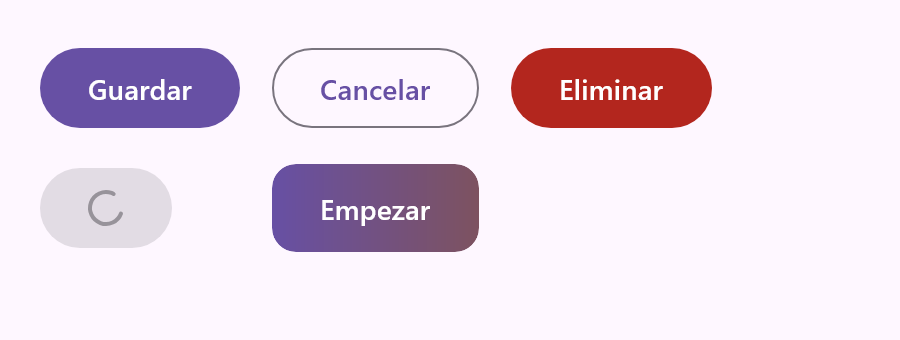


### Tarjetas — `...composeui.cards`

```kotlin
InfoCard(
    title = "Ajustes",
    subtitle = "Notificaciones, tema, idioma",
    onClick = { /* navegar */ },
)

ExpandableCard(title = "Detalles del pedido") {
    Text("Contenido que se despliega con animación")
}
```

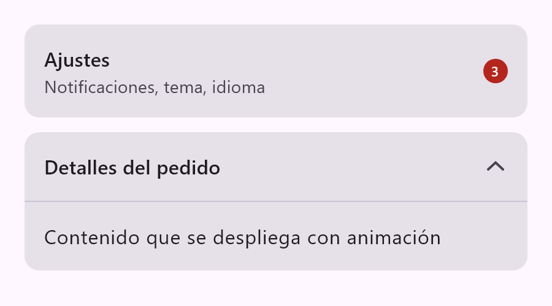


### Campos de texto — `...composeui.textfields`

```kotlin
LabeledTextField(
    value = email,
    onValueChange = { email = it },
    label = "Correo",
    errorMessage = if (emailValido) null else "Correo no válido",
)

PasswordTextField(value = password, onValueChange = { password = it })

SearchField(value = query, onValueChange = { query = it })
```

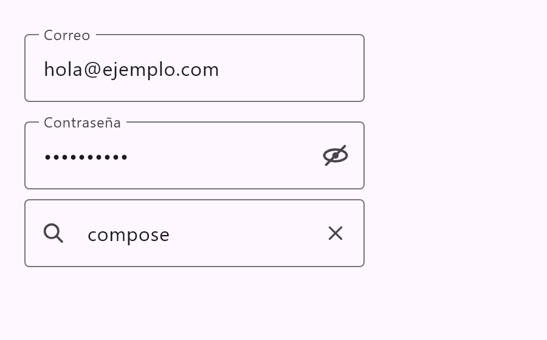


### Chips — `...composeui.chips`

```kotlin
// Selección múltiple
FilterChipGroup(
    options = listOf("Kotlin", "Compose", "KMP"),
    selectedOptions = selected,
    onSelectionChange = { selected = it },
)

// Selección única
ChoiceChipRow(
    options = listOf("Día", "Semana", "Mes"),
    selectedOption = period,
    onOptionSelected = { period = it },
)
```

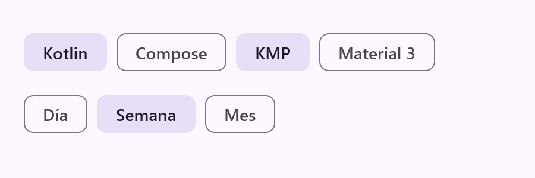


### Diálogos — `...composeui.dialogs`

```kotlin
if (showDeleteDialog) {
    ConfirmDialog(
        title = "Eliminar elemento",
        message = "Esta acción no se puede deshacer.",
        destructive = true,
        onConfirm = { viewModel.delete() },
        onDismiss = { showDeleteDialog = false },
    )
}
```

### Avisos — `...composeui.banners`

```kotlin
InlineBanner(
    message = "Hay una nueva versión disponible.",
    severity = BannerSeverity.Info, // Info, Success, Warning o Error
    actionText = "Actualizar",
    onAction = { /* ... */ },
    onDismiss = { /* muestra una X para descartar */ },
)
```

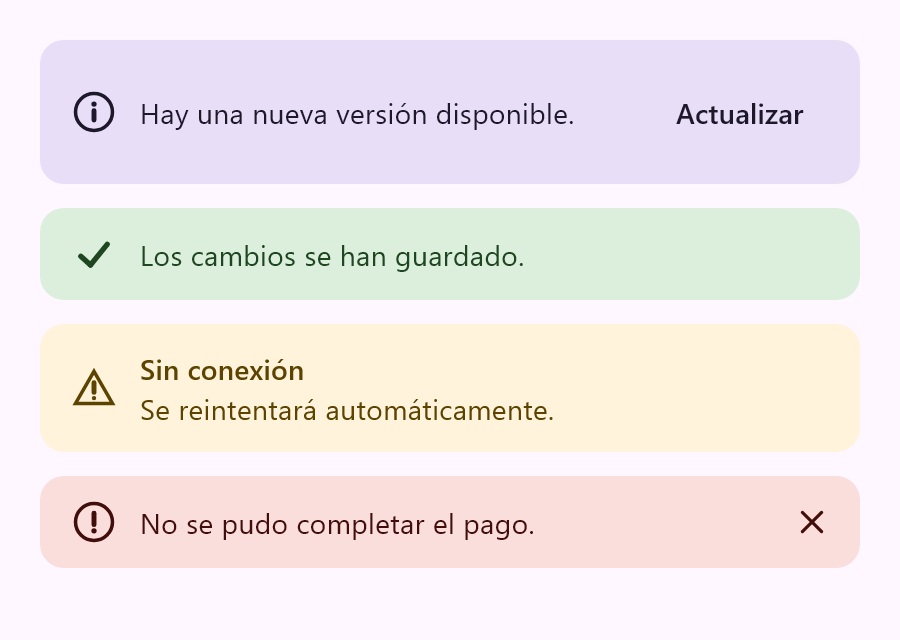

### Ajustes — `...composeui.settings`

```kotlin
SwitchRow(
    title = "Notificaciones",
    subtitle = "Avisos de actividad en tu cuenta",
    checked = notificationsEnabled,
    onCheckedChange = { notificationsEnabled = it },
)

CheckboxRow(
    title = "Boletín semanal",
    checked = newsletter,
    onCheckedChange = { newsletter = it },
)

RadioGroup(
    options = listOf("Claro", "Oscuro", "Sistema"),
    selectedOption = theme,
    onOptionSelected = { theme = it },
)
```

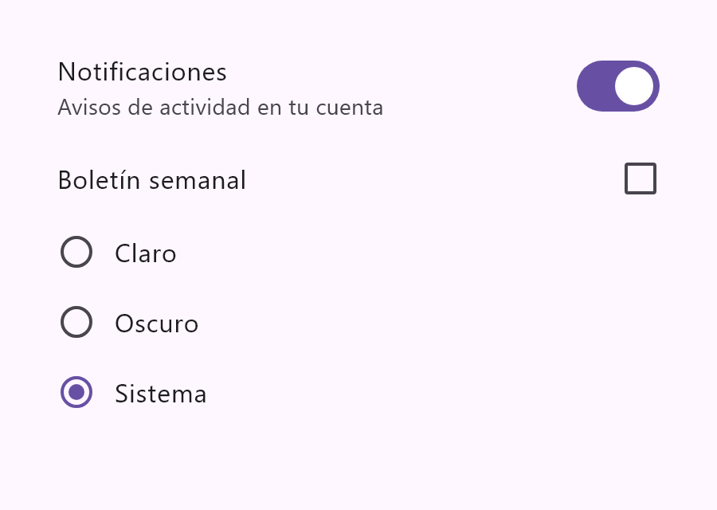

### Avatares — `...composeui.avatars`

```kotlin
// Iniciales con color determinista derivado del nombre
InitialsAvatar(name = "Ada Lovelace")

// Grupo solapado; si hay más de maxVisible muestra "+N"
AvatarGroup(
    names = listOf("Ada Lovelace", "Grace Hopper", "Alan Turing", /* ... */),
    maxVisible = 4,
)
```

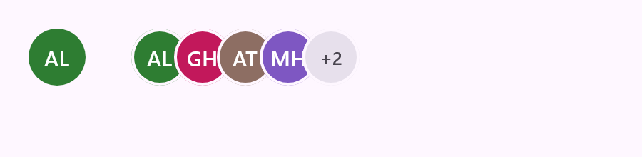

### Steppers — `...composeui.steppers`

```kotlin
// Selector de cantidad (carritos, entradas...)
QuantityStepper(value = qty, onValueChange = { qty = it }, range = 0..99)

// Progreso de un asistente por pasos
StepProgressIndicator(
    steps = listOf("Carrito", "Envío", "Pago", "Confirmar"),
    currentStep = 2,
)
```

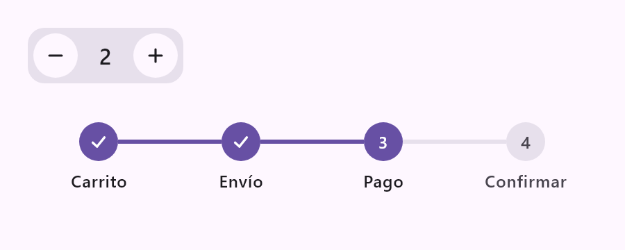

### Carga — `...composeui.loading`

```kotlin
FullScreenLoading(message = "Cargando…")

LoadingOverlay(visible = isLoading) {
    MiContenido()
}

// Placeholder shimmer
Box(Modifier.fillMaxWidth().height(20.dp).shimmer())
```

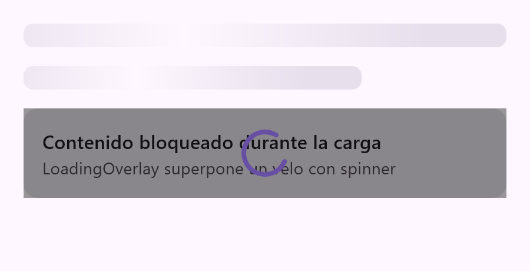


### Estados — `...composeui.states`

```kotlin
EmptyState(
    title = "Sin resultados",
    message = "Prueba con otros filtros",
    actionText = "Limpiar filtros",
    onAction = { /* ... */ },
)

ErrorState(
    title = "Algo salió mal",
    message = error.message,
    onRetry = { viewModel.reload() },
)
```

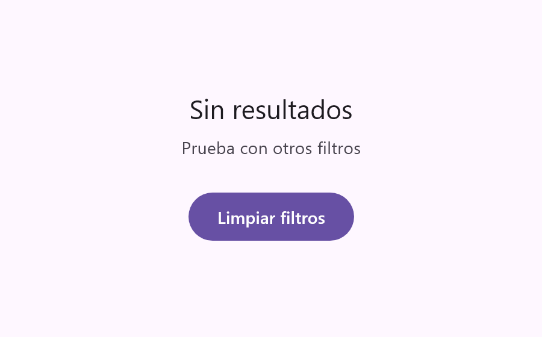


### Valoración — `...composeui.rating`

```kotlin
RatingBar(
    rating = rating,
    onRatingChange = { rating = it }, // null para solo lectura
)
```


### Varios — `...composeui.misc`

```kotlin
SectionHeader(title = "Populares", actionText = "Ver todo", onAction = { /* ... */ })

CounterBadge(count = 128) // muestra "99+"

// Divisor con etiqueta centrada
LabeledDivider(text = "o continúa con")
```

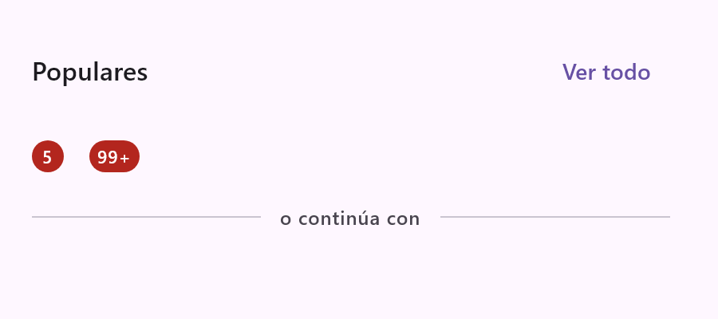


## Compilar el proyecto

```bash
./gradlew :library:assemble
```

- En **Windows/Linux** se compilan Android, Desktop y Web (los targets de iOS se omiten automáticamente).
- En **macOS** se compilan todos los targets, incluido iOS.

Las capturas del README se generan renderizando los componentes con Compose Desktop (sin emulador):

```bash
./gradlew :library:generateScreenshots
```

## Publicar en Maven Central

La publicación usa el [Central Portal de Sonatype](https://central.sonatype.com) mediante el plugin de Vanniktech. **Ninguna credencial vive en este repositorio**: todo se pasa por variables de entorno o GitHub Secrets.

1. Crea una cuenta en [central.sonatype.com](https://central.sonatype.com) y verifica el namespace `io.github.ricardomorarey` (basta con demostrar que controlas la cuenta de GitHub).
2. Genera un token de publicación (username + password).
3. Crea una clave GPG y exporta la privada en ASCII: `gpg --armor --export-secret-keys TU_ID`.
4. En GitHub, ve a *Settings → Secrets and variables → Actions* y crea los secrets `MAVEN_CENTRAL_USERNAME`, `MAVEN_CENTRAL_PASSWORD`, `SIGNING_KEY` y `SIGNING_KEY_PASSWORD`.
5. Crea una *release* en GitHub: el workflow [publish.yml](.github/workflows/publish.yml) compila (en macOS, para incluir iOS) y publica automáticamente.

## Seguridad

- `local.properties` (rutas locales de tu máquina) está en `.gitignore` y no se sube.
- Las claves de firma y tokens solo se leen de variables de entorno / GitHub Secrets.
- El `.gitignore` bloquea además `*.jks`, `*.keystore`, `*.gpg`, `*.asc` y similares por si acaso.

## Licencia

[MIT](LICENSE) © ricardomorarey
